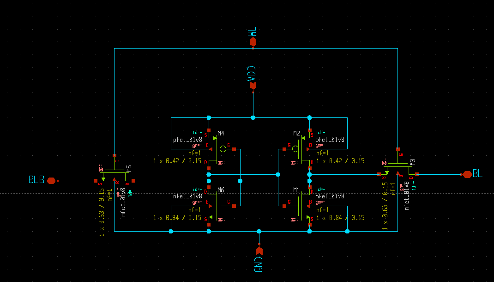
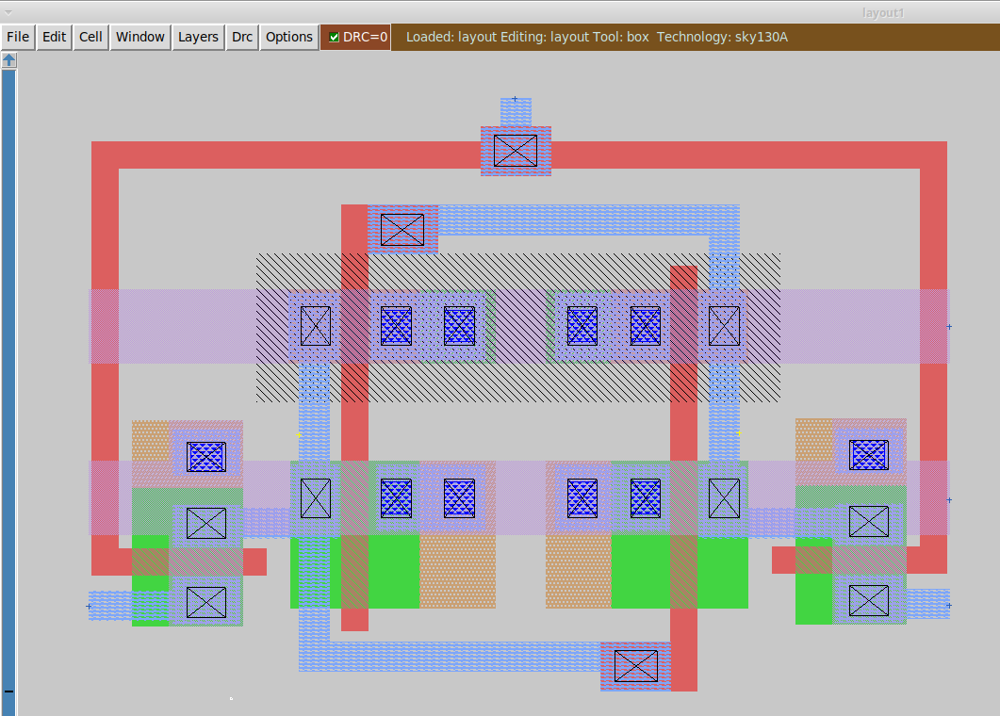
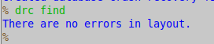
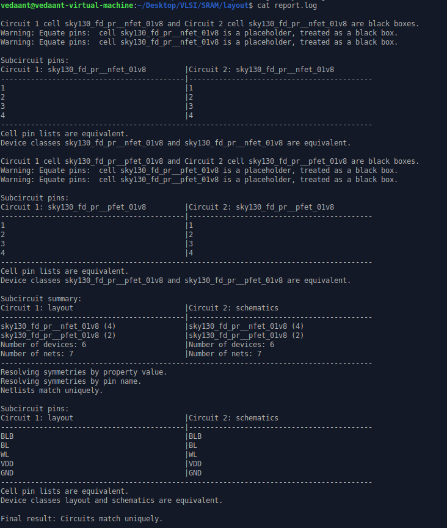

**Sky130 6T SRAM Cell Design**

**Overview** 
This repository represents complete custom vlsi design flow of a 6T SRAM cell using open source PDK. 
Project covers entire design cycle from transistor level schematics capture to physical layout, design verification, parasitic extraction and post layout timing and power chracterization.

• Technology: Sky130A (130 nm)  
• Schematic Capture: Xschem  
• Layout: Magic VLSI  
• DRC: Passed  
• LVS: Passed  
• Post-layout Parasitic Extraction: Completed  
• Simulator: ngspice  

Results (After Parasitic Extraction)
--------
Write '1' Delay : 66 ps  
Write '0' Delay : 39.8 ps  
Read Delay      : 68 ps  
Peak Current    : 6.08 µA  
Average Power   : 19.14 pW  

**Screenshots** 

**Schematics** 

 
**Layout** 

 
**DRC Result** 

 
**LVS Result** 
 

**Refrences** 
Xschem 
Netgen 
Magic VLSI 
ngspice 
SkyWater SKY130 Open PDK
